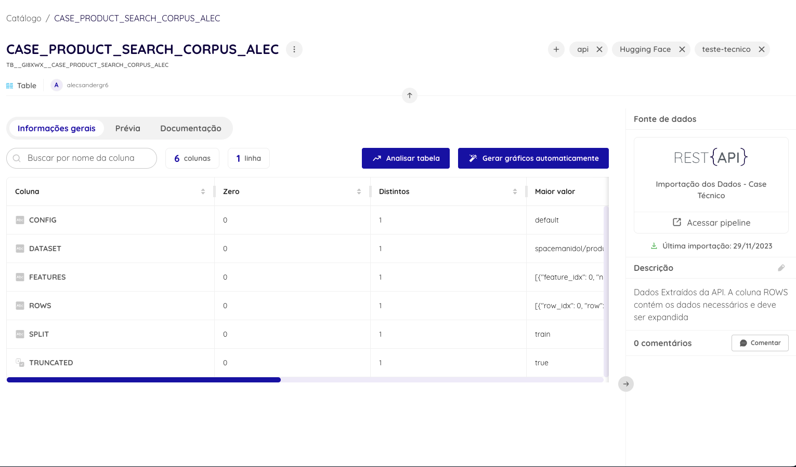
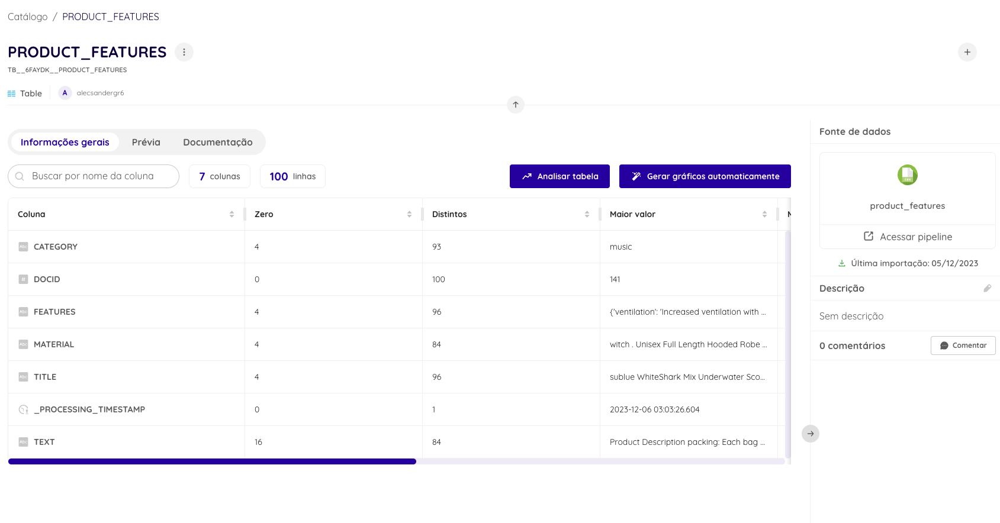
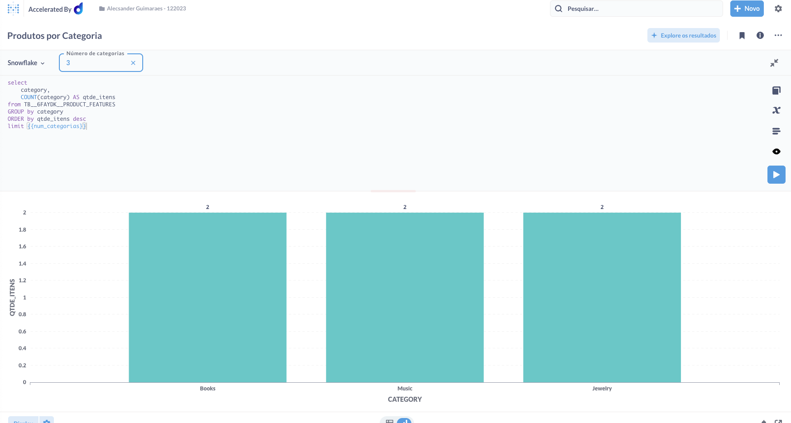
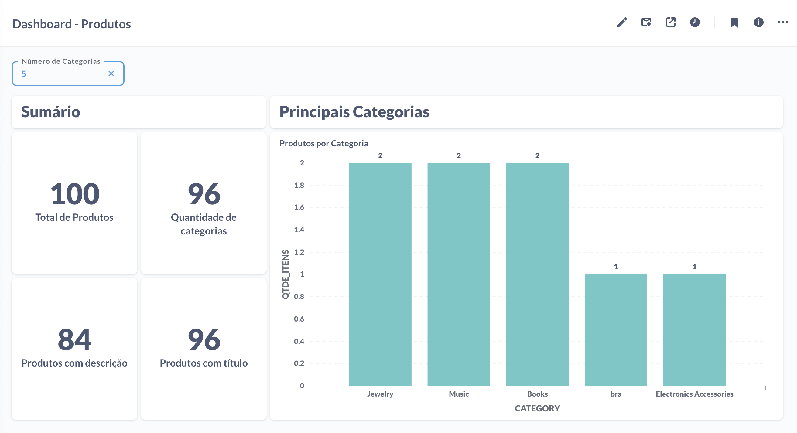
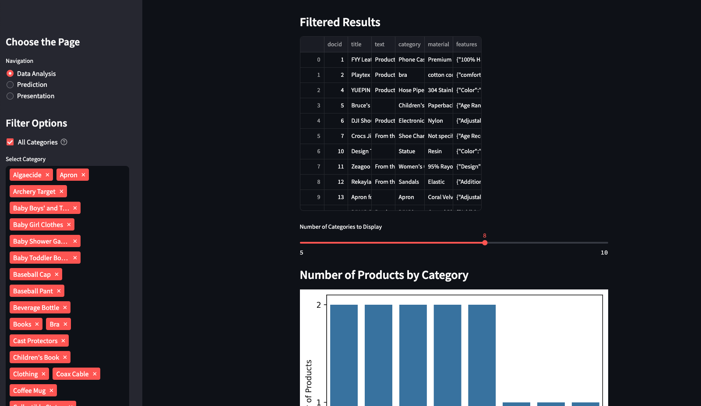
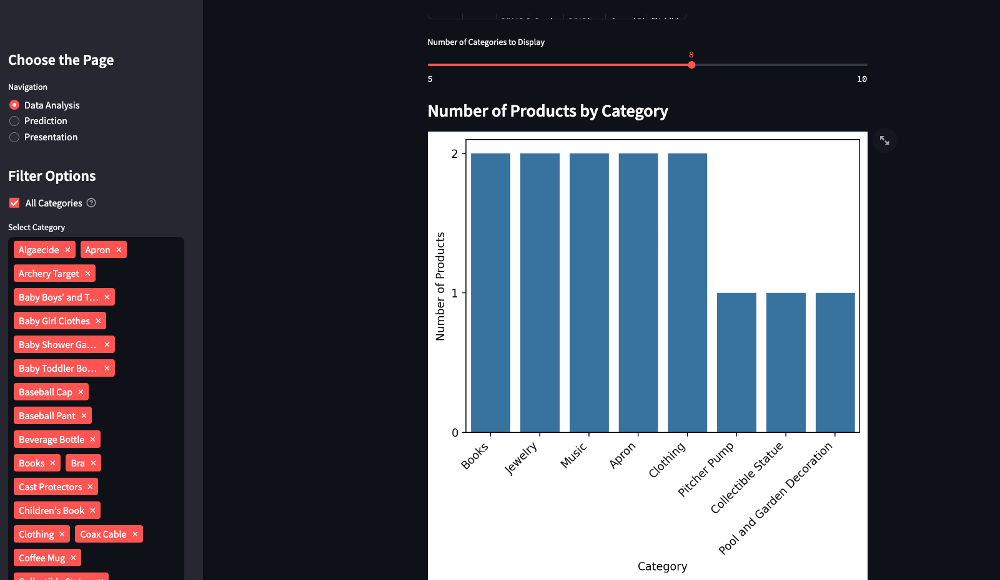
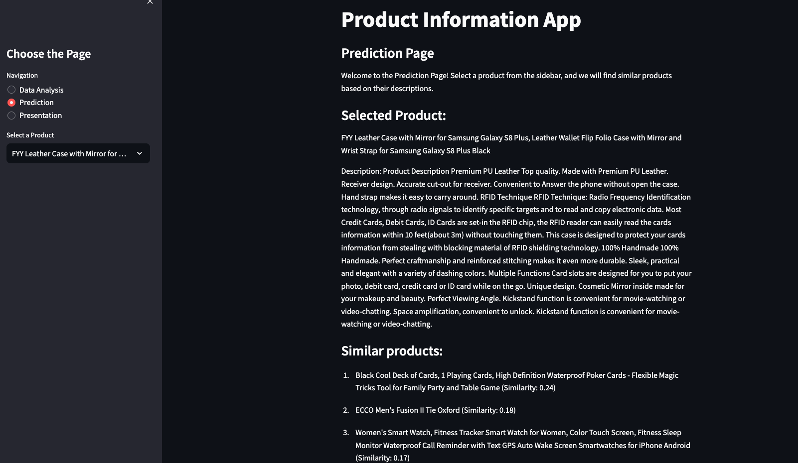
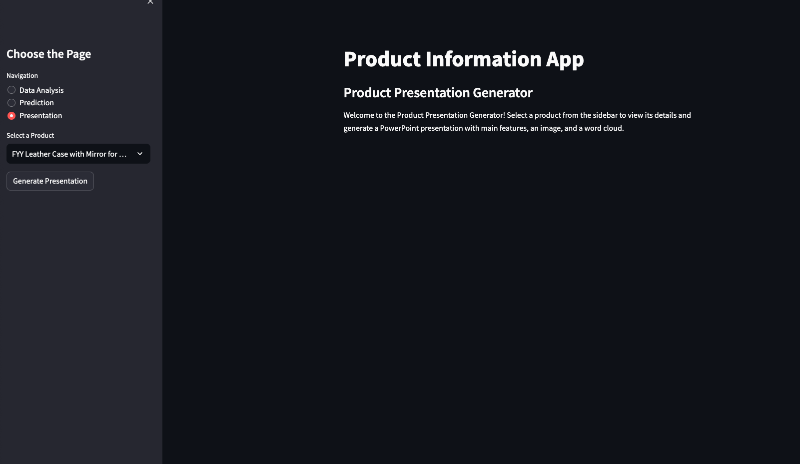
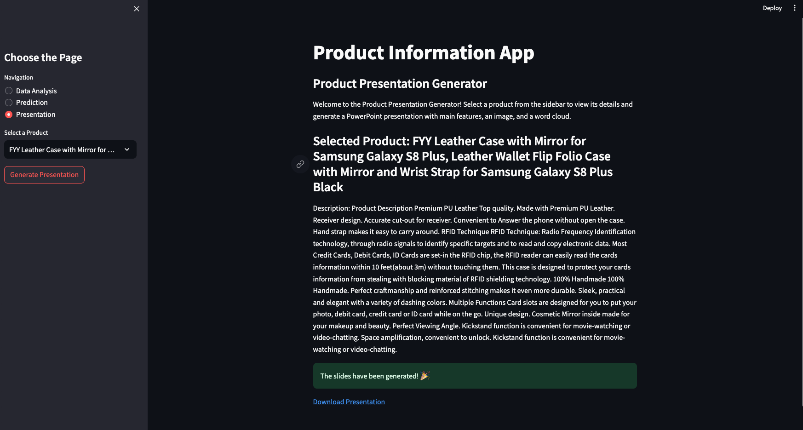
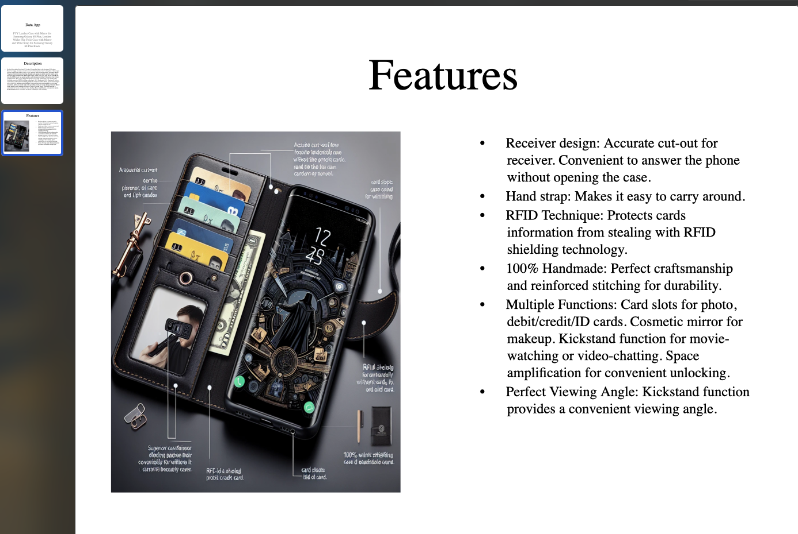

# Caso Técnico - Dadosfera <!-- omit in toc -->

Esse repositório tem como objetivo responder as questões do Caso Técnico para a posição de Analista de Dados.

Autor: Alecsander Guimarães Rodrigues

GitHub: https://github.com/alecsandergr

LinkedIn: https://linkedin.com/in/alecsandergr

## Sumário <!-- omit in toc -->

- [Item 1 - Sobre Storytelling e Apresentação](#item-1---sobre-storytelling-e-apresentação)
- [Item 2 - Sobre a Dadosfera](#item-2---sobre-a-dadosfera)
- [Item 3 - Sobre GenAI e LLMs](#item-3---sobre-genai-e-llms)
- [Item 4 - Sobre SQL e Python](#item-4---sobre-sql-e-python)
- [Item 5 - Sobre Data Apps](#item-5---sobre-data-apps)
- [Item Bonus - Sobre GenAI + Data Apps](#item-bonus---sobre-genai--data-apps)

## Item 1 - Sobre Storytelling e Apresentação
Item não respondido.

## Item 2 - Sobre a Dadosfera

A imagem abaixo contém os dados extraídos da API carregados na plataforma da Dadosfera. A tabela ainda não está no formato adequado para a análise dos dados e deve passar por um tratamento.

## Item 3 - Sobre GenAI e LLMs

Para esse item não foi tive acesso ao módulo de Inteligência da plataforma. Por isso, utilizei a minha própria máquina para a construção do código que faz a extração dos dados da API e para cada item são criadas as *features*, contendo uma categoria, material e outras *features*.
O código pode ser disponibilizado caso necessário, 
uma tabela com os dados também foi carregada na plataforma da Dadosfera para a resolução do [Item 4](#item-4---sobre-sql-e-python) a partir de um arquivo locals.

## Item 4 - Sobre SQL e Python

O dashboard foi construído com base em duas consultas, uma para a quantidade de categorias únicas e outra para a quantidade de itens de cada categorias. Uma variável foi adicionada ao *dashboard* para o controle de categorias mostradas.

## Item 5 - Sobre Data Apps

O Data App foi criado fora da plataforma, pois não foi possível usar o módulo de Inteligência da plataforma. Assim, todo o código foi criado na máquina local. Foram criadas três abas para a página: 
- Análise descritiva: Contém a mesma análise do [Item 4](#item-4---sobre-sql-e-python). Sendo possível selecionar as categorias mostradas no gráfico, além de ser possível procurar o produto pelo título ou pela descrição. 
  

- Predição: É possível selecionar um produto e como base em sua descrição, cinco produtos similares são mostrados na página.
  

- Gerador de Apresentação: Essa página é referente ao [Item Bonus](#item-bonus---sobre-genai--data-apps). Pode-se escolher um produto para que seja gerada uma apresentação do produto automaticamente.
  

## Item Bonus - Sobre GenAI + Data Apps

Este item foi integrado ao [Item 5](#item-5---sobre-data-apps). Nele é possível fazer a geração automática de uma apresentação contendo as principais características do produto, juntamente com uma imagem gerada por meio de inteligência artificial e a descrição oriunda do dado da API.

